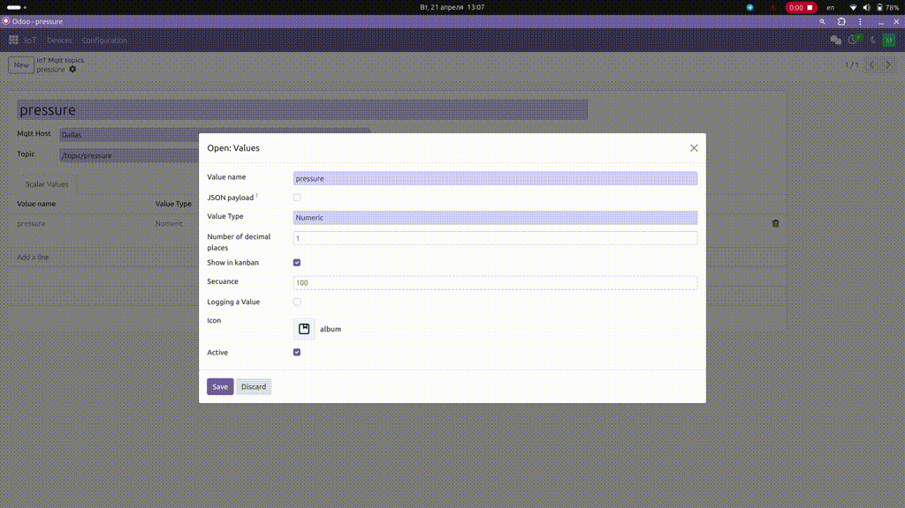

# Lucide Icons Module

This module provides a custom field type for Odoo that allows users to select icons from the Lucide icon set. The Lucide icon set is a collection of over 1,000 open-source icons that are designed to be simple, consistent, and easy to use.

## Features

- **Custom Field Type**: The module introduces a new field type called `lucide_icon` that can be used in Odoo models.
- **Icon Picker**: The field type includes an icon picker that allows users to browse and select icons from the Lucide icon set.
- **Search and Pagination**: The icon picker includes search functionality and pagination to make it easy to find the desired icon.
- **Integration with Odoo**: The module is designed to integrate seamlessly with Odoo, allowing users to use the Lucide icons in their custom views and models.

## Usage

To use the `lucide_icon` field type in your Odoo model, you can add the following code to your model definition:
```python
    lucide_icon = fields.Char(string='Lucide Icon', widget='lucide_icon')

    html = f'<i class="icon-{self.lucide_icon}"></i>'
```

```xml
    <i
        t-att-class="'icon-' + record.lucide_icon"
    ></i>

    <filed name="lucide_icon" widget="lucide_icon"/>
```

## Screencast



## License

This module is licensed under the LGPL-3.0 license.
