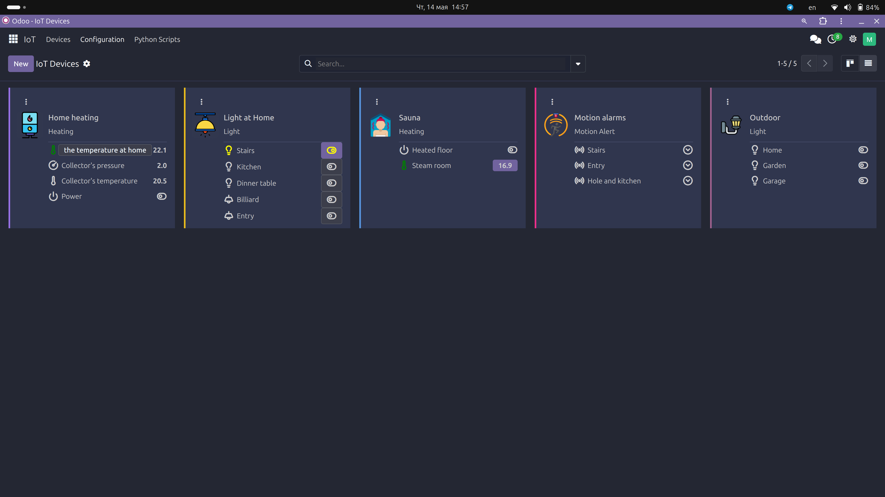
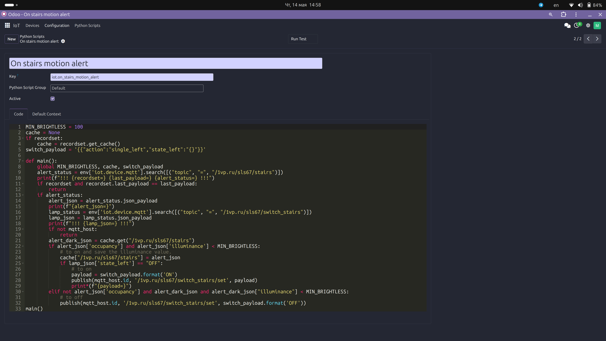

# Odoo IoT Management App

This Odoo app is designed to manage IoT (Internet of Things) devices, particularly those that communicate via MQTT (Message Queuing Telemetry Transport). The app provides a platform for automating tasks and processing data from IoT devices, with a focus on security and flexibility.

## Key Features

### IoT Device Management

- Models for managing IoT devices, including MQTT devices.
- Support for device values, topics, and communication systems.
- Kanban view integration for visualizing device values.

### MQTT Communication

- Models for MQTT hosts, topics, and values.
- Support for subscribing to topics and publishing messages.
- Logging of MQTT messages for debugging and monitoring.

### Python Scripting

- A restricted Python scripting environment for automating tasks and processing data.
- Support for running scripts on specific events or triggers.
- Access control and security features to restrict script execution.

### Redis Integration (not implemented yet) 

- Integration with Redis for caching and message brokering.
- Singleton pattern for managing Redis connections.

### User Interface

- Custom views for managing IoT devices, MQTT topics, and Python scripts.
- Kanban views for visualizing device values.
- Forms for configuring device settings and running scripts.

### Security

- Access control for Python scripts based on user groups.
- Restricted Python environment to prevent malicious code execution.

### Data Models

- Models for IoT devices, MQTT topics, values, and communication systems.
- Support for different value types (numeric, integer, boolean, string).
- Logging of device values for historical data analysis.

### Customization

- Support for custom icons and colors for device values.
- Templates for formatting MQTT messages.
- Hooks for running Python scripts on specific events.

## Getting Started

To get started with the Odoo IoT Management App, follow these steps:

1. Install the app in your Odoo environment.
2. Configure your IoT devices and MQTT hosts.
3. Set up Python scripts for automating tasks and processing data.
4. Customize the app as needed for your specific use case.

## Screens

 

## Contributing

Contributions to the Odoo IoT Management App are welcome. Please follow the standard Odoo contribution guidelines and submit your pull requests to the project repository.

## License

The Odoo IoT Management App is released under the [AGPL-3.0 license](LICENSE).
