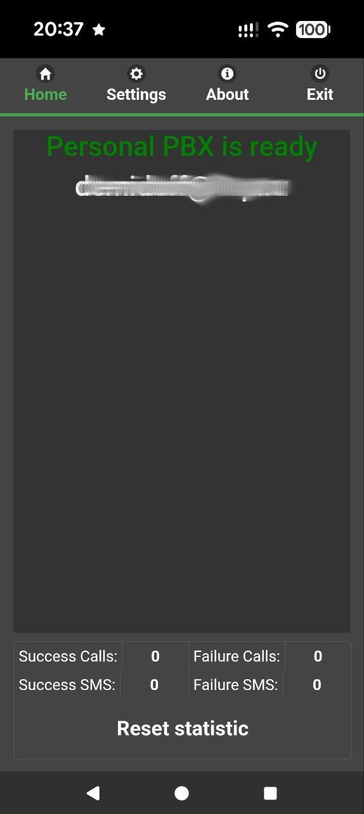
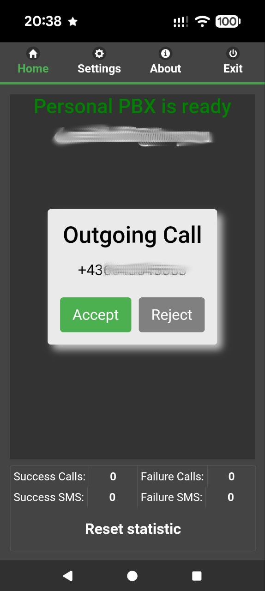
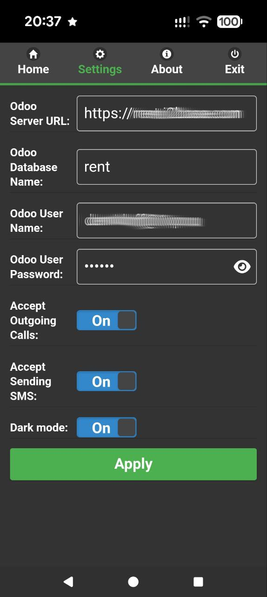

Operate Like a Large Enterprise
===============================

Empower Your Business Communication
-----------------------------------

**Personal PBX** is a revolutionary mobile app designed to replace traditional cloud PBX systems for Odoo users. By leveraging your Android device, the app enables you to make calls and send SMS directly through your mobile, fully integrated with your Odoo system. No more dependencies on complex cloud infrastructure—just seamless, mobile-powered communication.

Make calls and send SMS directly from any form in Odoo where Contacts are available.
Calls and contacts are logged in the activity journal.
Use this functionality in both the desktop and mobile versions of Odoo.

Why Choose Personal PBX?
------------------------

*   **Seamless Odoo Integration:** Connects your mobile device directly to your Odoo system. Manage calls and SMS without leaving the platform.
*   **Cost-Effective & Flexible:** Eliminate the need for expensive cloud PBX solutions. Uses your existing mobile device.
*   **User-Friendly & Efficient:** Intuitive interface for calls, SMS, and Odoo contact access.
*   **SMS Functionality Included:** Send directly through the app.

How It Works
------------

1.  **Install the App:** Download Personal PBX from the Google Play Store or follow the link below and link it to your Odoo system.
2.  **Make Calls & Send SMS:** Use your mobile device to handle all business communication, fully integrated with Odoo.

Who Is It For?
--------------

*   **Small and Medium Businesses:** Simplify communication without the complexity of traditional PBX systems.
*   **Remote Teams:** Stay connected to your Odoo system from anywhere.
*   **Odoo Users:** Enhance your Odoo experience with mobile-friendly communication tools.

Join the Future of Business Communication
-----------------------------------------

Personal PBX is more than just an app—it’s a smarter, more flexible way to manage your business calls and messages. Try it today and experience the freedom of mobile-powered communication with Odoo.

Download
--------

[**Click here to download the android mobile application**](static/src/files/odoo-peronal-pbx-release.latest.apk)

  

Daily Limits for the Mobile App:
--------------------------------

The current limits are 20 calls and 20 SMS per day. To remove these limits, please contact the developer.

Troubles:
---------

If you have the latest Android version, you might need to grant permission to send SMS.
See the instruction below to allow sending SMS: 
[**Learn about restricted settings - Android Help**](https://support.google.com/android/answer/12623953?hl=en)

Your Feedback Matters!
----------------------

We’re committed to improving Personal PBX and value your input. Whether it’s suggestions, bug reports, or feature requests, your feedback helps shape the future of the app.

Feedback
--------

Feel free to send any feedback to [alex.m.demidoff@gmail.com](mailto:alex.m.demidoff@gmail.com).
